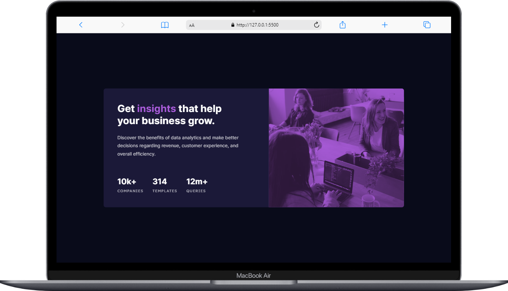

# Frontend Mentor - Stats preview card component solution

This is a solution to the [Stats preview card component challenge on Frontend Mentor](https://www.frontendmentor.io/challenges/stats-preview-card-component-8JqbgoU62). Frontend Mentor challenges help you improve your coding skills by building realistic projects.

## Table of contents

- [Overview](#overview)
  - [The challenge](#the-challenge)
  - [Screenshot](#screenshot)
  - [Links](#links)
- [My process](#my-process)
  - [Built with](#built-with)
  - [What I learned](#what-i-learned)
- [Author](#author)

## Overview

### The challenge

Users should be able to:

- View the optimal layout depending on their device's screen size

### Screenshot

|             Mobile             |             Desktop              |
| :----------------------------: | :------------------------------: |
|  |  |

### Links

- Solution URL: [here](https://github.com/asmaahamid02/stats-preview-card-component)
- Live Site URL: [here](https://asmaahamid02.github.io/stats-preview-card-component/)

## My process

### Built with

- Semantic HTML5 markup
- CSS custom properties
- Flexbox
- Mobile-first workflow
- Media queries

### What I learned

I learned how to use pseudo-elements and how to use them to create an overlay on top of an image. I also learned how to use the `mix-blend-mode` property to blend the image with the background.

```css
.card-media > img {
  opacity: 0.7;
  mix-blend-mode: multiply;
}
```

## Author

- Website - [Asmaa Hamid](https://linktr.ee/asmaahamid02)
- Frontend Mentor - [@asmaahamid02](https://www.frontendmentor.io/profile/asmaahamid02)

